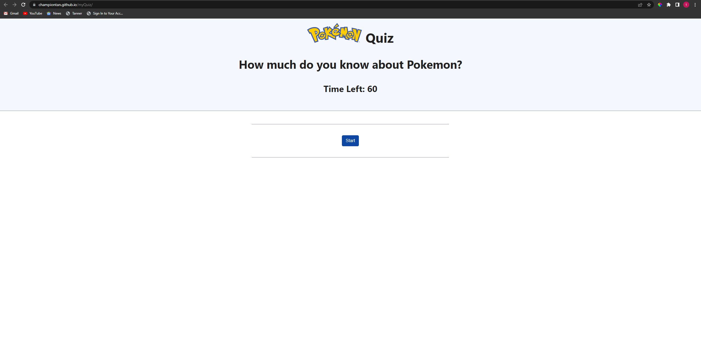

# myQuiz

[Link to my project](https://championtan.github.io/myQuiz/)

## Table of contents
- [Description](#description-of-project)
- [visuals](#visuals)

## Description of project
I created a quiz about Pokemon using javascript, HTML, and CSS.

## Visuals
 